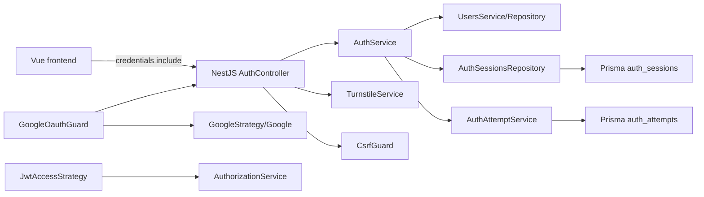
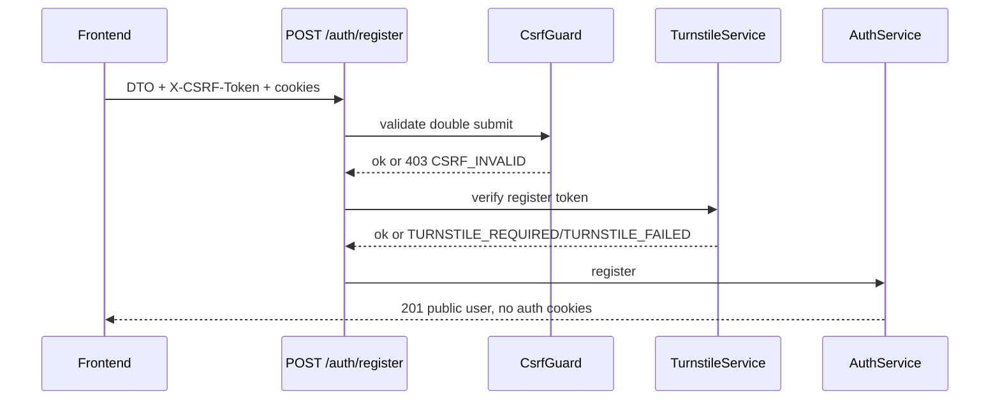
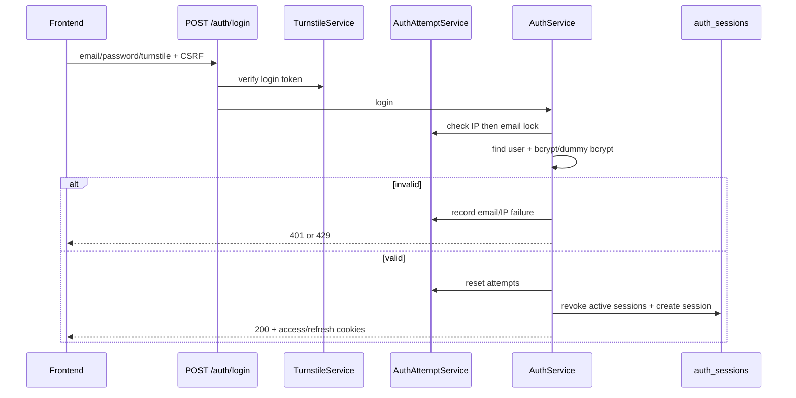
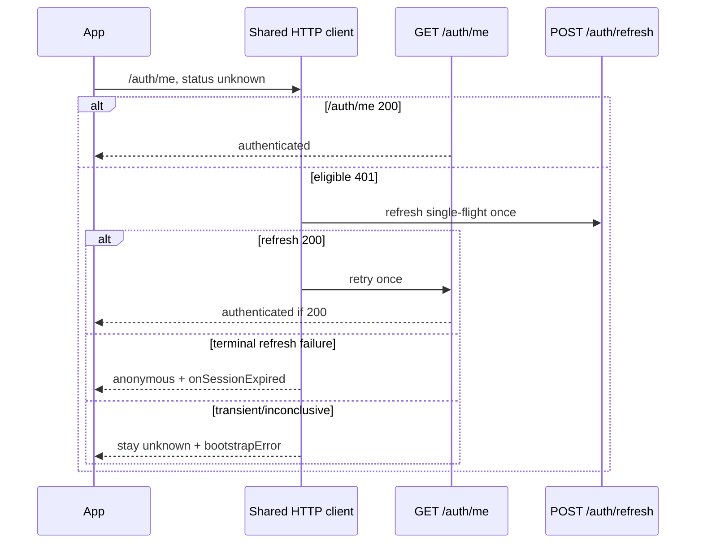
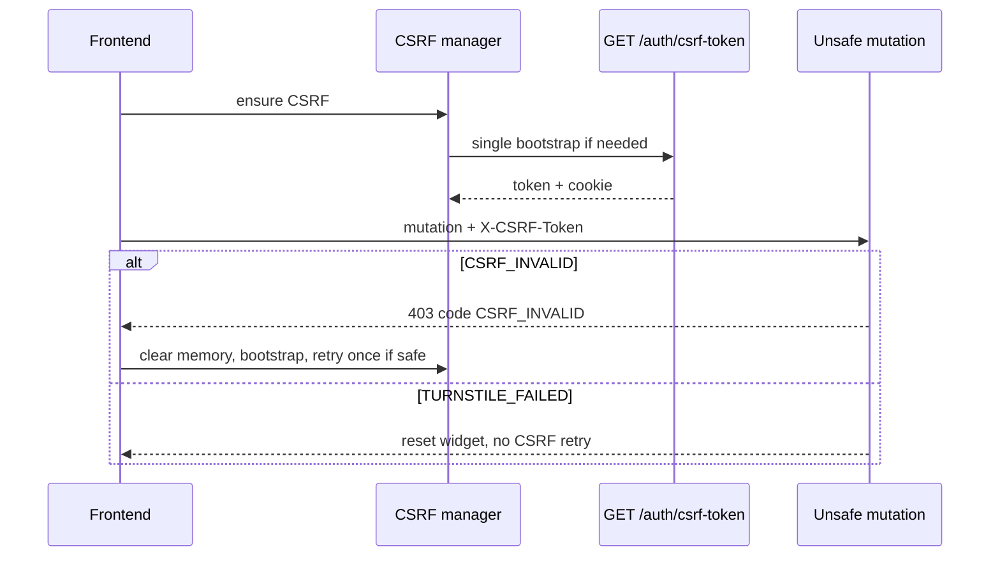
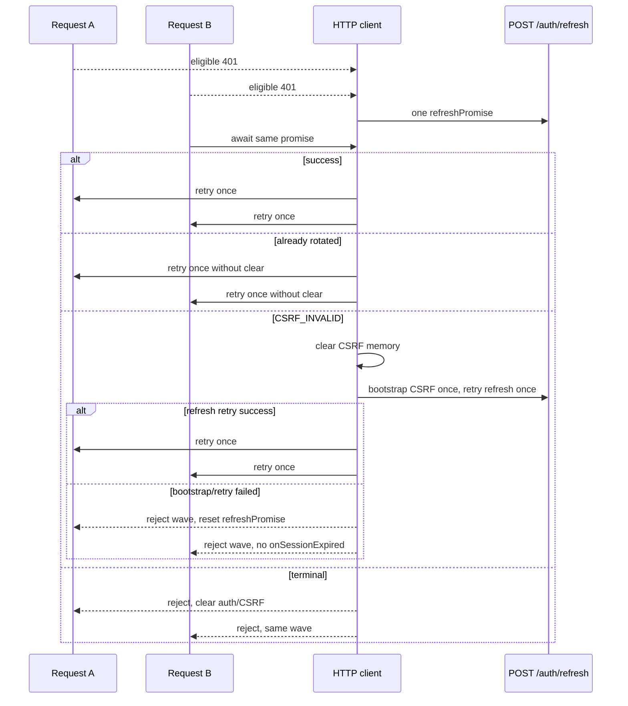
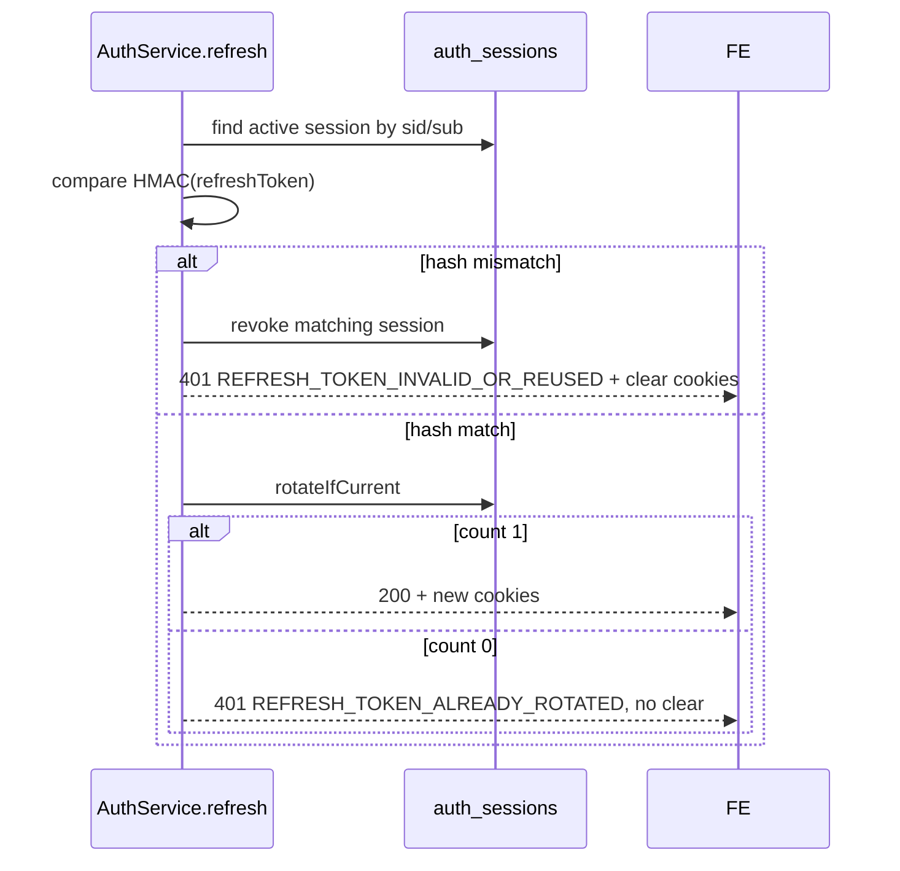
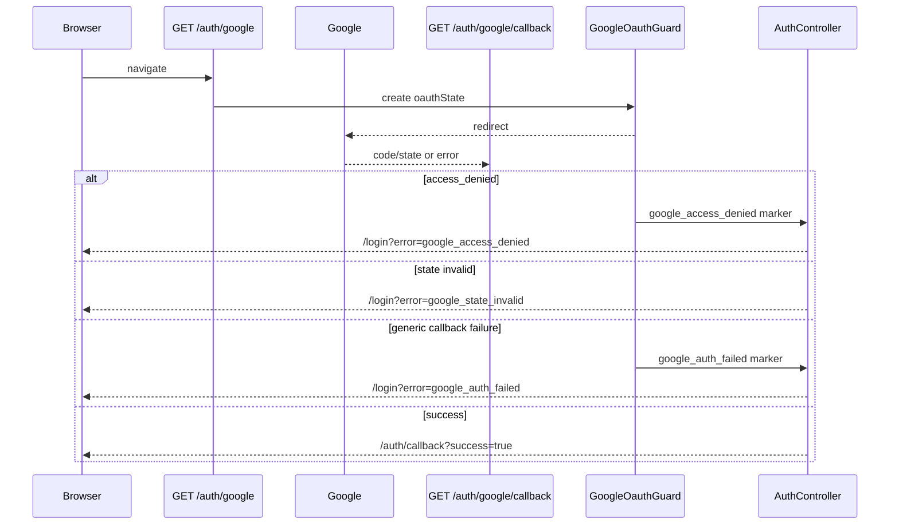
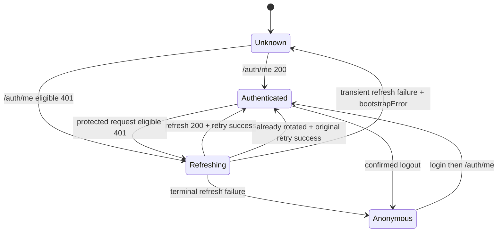
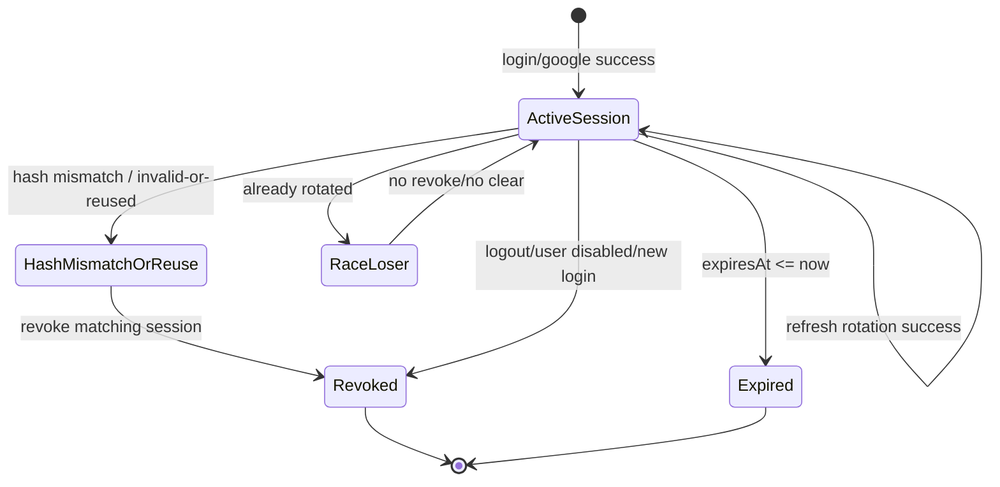

# Bookora Frontend-Backend Auth Integration Contract

## 1. Mục đích và phạm vi

Tài liệu này là contract tích hợp Auth giữa frontend Vue và backend NestJS Bookora tại runtime hiện tại. Nguồn sự thật theo thứ tự: backend runtime source, Prisma/database condition, backend tests, `docs/openapi.json`, rồi mới đến tài liệu này.

Phạm vi contract bao gồm cookie-based Auth, CSRF, Turnstile, local register/login, refresh rotation, logout, `/auth/me`, Google OAuth redirect flow, lỗi Auth machine-readable và nghĩa vụ frontend. Tài liệu không mô tả thay đổi frontend đã tồn tại; các yêu cầu frontend được ghi là integration obligation.

**Implemented behavior**

- Auth transport dùng cookie, không dùng bearer token từ frontend.
- Access token và refresh token là JWT được set trong HttpOnly cookie.
- Refresh token được bind với `AuthSession.refreshTokenHash` và rotate qua `/auth/refresh`.
- CSRF dùng double-submit cookie/header cho route có `CsrfGuard`.
- CSRF và Turnstile hiện có machine-readable error code.
- Google OAuth callback failure đã được normalize về redirect frontend.

**Source evidence**

- `src/modules/auth/auth.controller.ts` - `AuthController`
- `src/modules/auth/auth.service.ts` - `AuthService`
- `src/modules/auth/auth-error-codes.ts` - `AUTH_ERROR_CODES`
- `src/modules/auth/guards/csrf.guard.ts` - `CsrfGuard`
- `src/modules/auth/turnstile.service.ts` - `TurnstileService`
- `src/modules/auth/guards/google-oauth.guard.ts` - `GoogleOauthGuard`
- `src/modules/auth/strategies/google.strategy.ts` - `GoogleStrategy`

## 2. Nguồn sự thật và phiên bản được audit

- Commit audit: `e129ff1761ead0d1c985a0751ff1c1a56ec071a1`
- GitNexus indexed commit: `e129ff1`
- GitNexus status: `up-to-date`
- Audit date: `2026-07-02`
- `gitnexus status` trực tiếp bị PowerShell ExecutionPolicy chặn; đã dùng `node .gitnexus/run.cjs status`.
- Working tree trước khi bắt đầu đã có thay đổi sẵn: `AGENTS.md`, `CLAUDE.md`, `auth-contract.md` untracked.

**Source evidence**

- `git status --short`
- `git rev-parse HEAD`
- `node .gitnexus/run.cjs status`
- `docs/openapi.json`

## 3. Tổng quan kiến trúc Auth



Trust boundaries:

- Browser không đọc `accessToken` hoặc `refreshToken` vì cookie `HttpOnly`.
- Browser có thể nhận CSRF token từ body `/auth/csrf-token`; cookie `csrfToken` là `httpOnly: false`.
- OAuth state nằm trong signed cookie `oauthState`; frontend không cần đọc.
- IP login lock dùng Express `req.ip`; độ tin cậy phụ thuộc `TRUST_PROXY`.

**Source evidence**

- `src/core/app.setup.ts`
- `src/modules/auth/auth.service.ts`
- `src/modules/auth/strategies/jwt-access.strategy.ts`
- `src/modules/authorization/authorization.service.ts`

## 4. Quy ước HTTP chung

### 4.1 Base URL và API version

- Global prefix runtime: `app.apiPrefix`, default `api`.
- URI versioning default: `v1`.
- OpenAPI server path: `/api/v1`.
- JSON endpoints dùng `application/json`.

### 4.2 CORS và credentials

- CORS bật `credentials: true`.
- Origin lấy từ `FRONTEND_URL`, fallback `CORS_ORIGIN`, default `http://localhost:5173`.
- Frontend phải bật `credentials: 'include'` hoặc `withCredentials: true`.

### 4.3 Success envelope

```json
{
  "statusCode": 200,
  "message": "Thành công",
  "data": {}
}
```

### 4.4 Error envelope

```json
{
  "statusCode": 403,
  "message": "CSRF token không hợp lệ",
  "error": "ForbiddenException",
  "code": "CSRF_INVALID",
  "errors": [],
  "path": "/api/v1/auth/login",
  "method": "POST",
  "timestamp": "2026-07-02T00:00:00.000Z"
}
```

`code` chỉ có khi exception body có `code`. Validation có `errors`. Runtime hiện tại không có correlation id trong response.

### 4.5 Generated client response shape

Backend repository hiện tại không chứa frontend source, Orval config, `customInstance`, Axios boundary hoặc generated client artifact để xác minh chính xác generated function unwrap response tới mức nào.

Backend contract chỉ đảm bảo HTTP success envelope runtime:

```ts
type BackendSuccessEnvelope<T> = {
  statusCode: number;
  message: string;
  data: T;
};
```

Frontend phải xác minh từ generated type/customInstance hiện tại ở frontend repo hoặc integration artifact thực tế:

```ts
const response = await login(payload);
// Có thể là BackendSuccessEnvelope<PublicAuthUser>,
// PublicAuthUser, hoặc shape khác tùy customInstance.
```

Không được suy đoán rằng generated function unwrap `AxiosResponse.data` hay unwrap tiếp backend envelope `.data` nếu chưa kiểm chứng từ source frontend.

**Source evidence**

- `src/config/app.config.ts`
- `src/core/app.setup.ts`
- `src/core/interceptors/transform.interceptor.ts`
- `src/core/filters/all-exceptions.filter.ts`
- `src/common/utils/exception.util.ts`

## 5. Cookie contract

### 5.1 Cookie matrix đầy đủ

| Cookie | Purpose | Set by | Cleared by | HttpOnly | Secure | SameSite | Path | Domain | Expiry |
| ------ | ------- | ------ | ---------- | -------- | ------ | -------- | ---- | ------ | ------ |
| `accessToken` | Access JWT cho protected API | Login, Google login, refresh success | `clearAuthCookies()` trong logout và terminal refresh failures | `true` | `true` nếu `NODE_ENV=production`, ngược lại `false` | `none` nếu production cross-site theo `COOKIE_DOMAIN`/`FRONTEND_URL`, ngược lại `lax` | `/` | `COOKIE_DOMAIN` nếu có | `JWT_ACCESS_EXPIRES_IN`, default `15m` |
| `refreshToken` | Refresh JWT cho `/auth/refresh` và logout fallback | Login, Google login, refresh success | `clearAuthCookies()` | `true` | như trên | như trên | `/` | như trên | `JWT_REFRESH_EXPIRES_IN`, default `7d` |
| `csrfToken` | Double-submit CSRF token | `GET /auth/csrf-token` | `clearAuthCookies()` | `false` | như trên | như trên | `/` | như trên | refresh max age, default `7d` |
| `oauthState` | Signed OAuth state | `GET /auth/google` qua `GoogleOauthGuard` | callback success/failure hoặc `clearAuthCookies()` | `true` | như trên | như trên | `/` | như trên | `10 * 60 * 1000` ms |

### 5.2 Development và production behavior

- `NODE_ENV=production` làm cookie `secure: true`.
- Non-production dùng `secure: false`.
- `sameSite` là `none` chỉ khi production và frontend host cross-site với configured backend domain.
- Không log hoặc expose secret cookie/JWT.

### 5.3 Cross-site deployment considerations

- `COOKIE_DOMAIN` cần khớp domain deployment để browser gửi cookie.
- `FRONTEND_URL` quyết định CORS origin và cross-site cookie calculation.
- Frontend không tự đọc/xóa `accessToken` hoặc `refreshToken`; chỉ server/browser xử lý HttpOnly cookie.

**Source evidence**

- `src/modules/auth/auth.service.ts` - `setAuthCookies()`, `clearAuthCookies()`, `baseCookieOptions()`
- `src/config/cookie.config.ts`
- `src/config/auth.config.ts`

## 6. Token và session model

- Access/refresh payload: `{ sub, email, sid }`.
- `sub` là `User.id`; `sid` là `AuthSession.id`.
- Access token verify bằng `auth.jwt.accessSecret`.
- Refresh token verify bằng `auth.jwt.refreshSecret`.
- Refresh token hash dùng HMAC SHA-256 với `REFRESH_TOKEN_HASH_SECRET`.
- Active session condition: `id`, `userId`, `revokedAt = null`, `expiresAt > now`.
- User phải `isActive = true`.

Session states:

- Created: tạo `AuthSession` với temporary hash.
- Active: session có hash refresh token issued hiện tại.
- Rotated: `rotateIfCurrent()` update hash và expiry.
- Expired: `expiresAt <= now`; queries active không match.
- Revoked: `revokedAt` set.
- Hash mismatch / invalid-or-reused: JWT xác định active session nhưng request token hash không match current hash.
- Already-rotated race loser: atomic update count `0`, không revoke, không clear cookies.

**Source evidence**

- `src/modules/auth/types/jwt-payload.type.ts`
- `src/modules/auth/auth.service.ts` - `startSession()`, `refresh()`
- `src/modules/auth/auth-sessions.repository.ts`
- `prisma/schema/20-auth-users-branches.models.prisma`

## 7. CSRF contract

### 7.1 Backend runtime

`GET /auth/csrf-token` trả `{ csrfToken }` và set cookie `csrfToken`. `CsrfGuard` allow `GET`, `HEAD`, `OPTIONS`; unsafe methods phải có cookie `csrfToken` và header `X-CSRF-Token` matching bằng timing-safe comparison.

Auth routes có `CsrfGuard`:

- `POST /auth/register`
- `POST /auth/login`
- `POST /auth/logout`
- `POST /auth/refresh`

### 7.2 Machine-readable errors

CSRF failure trả:

```json
{
  "statusCode": 403,
  "message": "CSRF token không hợp lệ",
  "code": "CSRF_INVALID"
}
```

Bao gồm missing cookie, missing header, mismatch hoặc different-length token. Status/message/algorithm không đổi.

### 7.3 Frontend CSRF infrastructure invariants

**Frontend obligation / project integration invariant**

- Concurrent unsafe requests chỉ dùng một `csrfBootstrapPromise`.
- Caller-provided `X-CSRF-Token` không bị ghi đè.
- CSRF endpoint không tự bootstrap CSRF cho chính nó.
- Nếu CSRF bootstrap thất bại, mutation không được gửi.
- Rejected `csrfBootstrapPromise` phải được clear để request sau có thể thử lại.
- CSRF token chỉ lưu trong memory.
- Shared CSRF manager áp dụng cho `POST`, `PUT`, `PATCH`, `DELETE`.

Các invariant này là quyết định integration frontend Phase 3-4, không phải behavior backend tự thực thi.

### 7.4 CSRF và Turnstile 403 classification

Sau runtime hardening, frontend được phân loại bằng `code`, không parse localized message:

- `CSRF_INVALID`: clear CSRF memory, bootstrap token mới, retry original mutation tối đa một lần nếu body replay an toàn và request chưa có CSRF retry marker.
- `TURNSTILE_FAILED`: reset/lấy widget token mới, không retry bằng token cũ.

Không retry vô hạn. Không coi mọi `403` là CSRF.

**Source evidence**

- `src/modules/auth/guards/csrf.guard.ts`
- `src/modules/auth/guards/csrf.guard.spec.ts`
- `src/modules/auth/auth-error-codes.ts`
- `src/modules/auth/auth.controller.ts`

## 8. Auth state và application bootstrap

Bootstrap flow duy nhất:

1. App start, auth status = `unknown`.
2. Gọi `GET /auth/me` qua shared HTTP client.
3. Nếu `200`: hydrate store, status = `authenticated`.
4. Nếu eligible access-session `401`: shared client refresh single-flight đúng một lần.
5. Refresh `200`: retry `/auth/me` đúng một lần.
6. Retry `/auth/me` `200`: status = `authenticated`.
7. Terminal refresh failure hoặc retry `/auth/me` vẫn `401`: status = `anonymous`.
8. Transient/inconclusive refresh failure (`network`, timeout, cancellation, `429`, `5xx`): không chuyển user thành anonymous; giữ `unknown` kèm `bootstrapError` để app retry hoặc hiển thị unavailable state.
9. Router guard chỉ quyết định khi status không còn `unknown` hoặc app đã chọn unavailable handling.

Bootstrap không gọi refresh lần hai nếu shared interceptor đã xử lý `/auth/me`.

**Source evidence**

- `src/modules/auth/auth.controller.ts` - `me()`
- `src/modules/auth/guards/jwt-access.guard.ts`
- `src/modules/auth/strategies/jwt-access.strategy.ts`

## 9. Register flow

| Item | Runtime |
| ---- | ------- |
| Method/route | `POST /auth/register` |
| DTO | `RegisterDto` |
| CSRF | Required |
| Turnstile | `verifyToken(..., 'register')`; required when enabled |
| Throttle | default limit `10`, TTL `60s` |
| Success | `201`, public user |
| Session/cookie | Không tạo session, không set auth cookies |

Validation:

- `email`: `@IsEmail()`.
- `fullName`: string, min length `2`.
- `password`: string, min length `8`, phải có chữ và số.
- `turnstileToken`: optional trong schema, runtime required khi Turnstile enabled.

Success path: CSRF, throttle, Turnstile, normalize email, duplicate email check, bcrypt cost `12`, transactional CUSTOMER creation, provider `LOCAL`, role CUSTOMER requirement, return `PublicAuthUser`.

Failure statuses: validation `400`, `CSRF_INVALID` `403`, `TURNSTILE_REQUIRED` `400`, `TURNSTILE_FAILED` `403`, duplicate email `409`, missing active CUSTOMER role `500`, throttle `429`.

Frontend không coi register success là authenticated.

**Source evidence**

- `src/modules/auth/auth.controller.ts` - `register()`
- `src/modules/auth/dto/register.dto.ts`
- `src/modules/auth/auth.service.ts` - `register()`
- `src/modules/users/users.repository.ts` - `createCustomerForAuth()`

## 10. Local login flow

| Item | Runtime |
| ---- | ------- |
| Method/route | `POST /auth/login` |
| DTO | `LoginDto` |
| CSRF | Required |
| Turnstile | `verifyToken(..., 'login')`; required when enabled |
| Throttle | default limit `30`, TTL `60s` |
| Success | `200`, public user |
| Session/cookie | Revoke active sessions by user, create one session, set access/refresh cookies |

Flow:

1. CSRF.
2. HTTP throttle.
3. Turnstile.
4. Normalize email.
5. Client IP from `req.ip`, fallback socket, strip `::ffff:`.
6. Check IP lock first, then email lock.
7. Read user with password hash.
8. bcrypt compare with real hash or dummy hash.
9. Reject missing/inactive/wrong provider/missing hash/wrong password with generic `401`.
10. Record email/IP failure on failed credential path.
11. Reset attempts on success.
12. `startSession()` revoke active sessions by user.
13. Create session, sign token pair, store refresh hash, update `lastLoginAt`, set cookies.

After login success, frontend should call `/auth/me` to hydrate roles/permissions/branches.

**Source evidence**

- `src/modules/auth/auth.controller.ts` - `login()`, `getClientIp()`
- `src/modules/auth/auth.service.ts` - `login()`, `startSession()`
- `src/modules/auth/auth-attempt.service.ts`
- `src/modules/auth/auth.service.spec.ts`
- `src/modules/auth/auth.controller.spec.ts`

## 11. Turnstile contract

### 11.1 Runtime configuration

- `TURNSTILE_ENABLED`, default `false`.
- Production requires `TURNSTILE_ENABLED=true`.
- When enabled in production, `TURNSTILE_SECRET_KEY` and `TURNSTILE_EXPECTED_HOSTNAMES` are required.
- `TURNSTILE_SITEVERIFY_URL`, default Cloudflare endpoint.
- `TURNSTILE_LOGIN_ACTION`, default `login`.
- `TURNSTILE_REGISTER_ACTION`, default `register`.
- `TURNSTILE_TIMEOUT_MS`, default `3000`.

### 11.2 Verification flow

If disabled outside production, bypass. If enabled, backend posts `secret`, `response`, and optional `remoteip` to provider, validates response shape, `success`, hostname and action.

### 11.3 Failure mapping

| Runtime case | Status | Code |
| ------------ | -----: | ---- |
| Enabled but missing token | `400` | `TURNSTILE_REQUIRED` |
| Disabled in production | `403` | `TURNSTILE_FAILED` |
| Secret missing during HTTP flow | `403` | `TURNSTILE_FAILED` |
| Provider `success=false` | `403` | `TURNSTILE_FAILED` |
| Malformed provider response | `403` | `TURNSTILE_FAILED` |
| Hostname mismatch | `403` | `TURNSTILE_FAILED` |
| Action mismatch | `403` | `TURNSTILE_FAILED` |
| Network/timeout error | `403` | `TURNSTILE_FAILED` |

Message giữ nguyên: `Xác minh bảo mật thất bại, vui lòng thử lại.`

### 11.4 Frontend configuration obligation

Frontend cần biết site key và enabled state qua cấu hình public frontend:

- `VITE_TURNSTILE_ENABLED=true` thì render Turnstile cho login/register.
- `VITE_TURNSTILE_SITE_KEY` là public site key dùng cho widget.
- Không expose `TURNSTILE_SECRET_KEY`; secret key chỉ thuộc backend.
- Deployment frontend/backend phải đồng bộ: backend `TURNSTILE_ENABLED=true` thì frontend `VITE_TURNSTILE_ENABLED=true` và có `VITE_TURNSTILE_SITE_KEY`.
- Nếu backend bật Turnstile nhưng frontend tắt hoặc thiếu site key, login/register sẽ thất bại với `TURNSTILE_REQUIRED`.

Khi nhận `TURNSTILE_REQUIRED` hoặc `TURNSTILE_FAILED`, frontend reset widget/lấy token mới; không retry bằng token cũ. Task backend này không tạo frontend `.env`.

**Source evidence**

- `src/modules/auth/turnstile.service.ts`
- `src/modules/auth/turnstile.service.spec.ts`
- `src/config/auth.config.ts`
- `src/config/env.validation.ts`

## 12. HTTP throttling

| Route | Default limit | Default TTL | Config keys | 429 behavior |
| ----- | ------------: | ----------: | ----------- | ------------ |
| `POST /auth/login` | `30` | `60s` | `AUTH_LOGIN_LIMIT`, `AUTH_LOGIN_THROTTLE_LIMIT`, `AUTH_LOGIN_TTL_SECONDS`, `AUTH_LOGIN_THROTTLE_TTL_SECONDS` | Throttler `429`, no stable machine code |
| `POST /auth/register` | `10` | `60s` | `AUTH_REGISTER_LIMIT`, `AUTH_REGISTER_TTL_SECONDS` | `429`, no stable machine code |
| `POST /auth/refresh` | `10` | `60s` | `AUTH_REFRESH_LIMIT`, `AUTH_REFRESH_TTL_SECONDS` | transient/inconclusive for background refresh |
| `GET /auth/csrf-token` | `10` | `60s` | `AUTH_CSRF_LIMIT`, `AUTH_CSRF_TTL_SECONDS` | retry later; mutation must not be sent if bootstrap fails |

Global `AuthThrottlerGuard` is applied at `AuthController`; route-level `@Throttle` sets per-route limits. Contract không dựa vào exact `Retry-After` vì runtime không expose stable structured countdown trong contract.

**Source evidence**

- `src/modules/auth/auth.controller.ts`
- `src/modules/auth/guards/auth-throttler.guard.ts`
- `src/config/auth.config.ts`

## 13. Email/IP login lock

### 13.1 Email lock

Email key is normalized by trim/lowercase. Default threshold `5`, window `60s`, lock duration `60s` via `AUTH_LOGIN_MAX_ATTEMPTS`/`AUTH_EMAIL_MAX_FAILED_ATTEMPTS`, `AUTH_ATTEMPT_WINDOW_SECONDS`/`AUTH_LOGIN_TTL_SECONDS`, `AUTH_EMAIL_LOCK_SECONDS`/`AUTH_LOCK_WINDOW_MINUTES`.

### 13.2 IP lock

IP threshold default `10`, lock duration `120s` via `AUTH_IP_MAX_ATTEMPTS`/`AUTH_IP_MAX_FAILED_ATTEMPTS`, `AUTH_IP_LOCK_SECONDS`.

### 13.3 Reset và interaction giữa hai loại lock

Order: check active IP lock first, then email lock. Active email lock records IP failure and may escalate IP lock. Successful login resets both email and IP attempts. Missing email/wrong password/inactive/wrong provider all use generic credential failure.

### 13.4 Trust proxy và client IP

Controller uses `req.ip`, fallback `req.socket.remoteAddress`, and strips IPv4-mapped IPv6. It does not parse `X-Forwarded-For` directly. Correct proxy behavior depends on `TRUST_PROXY`.

### Login lock matrix

| Mechanism | Key | Threshold | Window | Lock duration | Reset | Frontend response |
| --------- | --- | --------: | ------ | ------------- | ----- | ----------------- |
| Email | normalized email | default `5` | default `60s` | default `60s` | successful login | Generic `429`; no exact stable countdown |
| IP | `req.ip` derived IP | default `10` | default `60s` | default `120s` | successful login | `429`; message may mention minutes but no structured code |

**Source evidence**

- `src/modules/auth/auth-attempt.service.ts`
- `src/modules/auth/auth-attempts.repository.ts`
- `src/modules/auth/auth.controller.spec.ts`
- `prisma/schema/20-auth-users-branches.models.prisma` - `AuthAttempt`

## 14. Access-token authentication

Protected routes use `JwtAccessGuard` and `JwtAccessStrategy`. The strategy reads `accessToken` cookie, verifies JWT, requires `sub` and `sid`, then resolves authorization principal. Guard failure returns `401` without machine-readable code.

Because access `401` has no code, frontend must use endpoint metadata/public-route exclusion/generated request metadata. Không refresh toàn bộ response `401` một cách blanket.

**Source evidence**

- `src/modules/auth/guards/jwt-access.guard.ts`
- `src/modules/auth/strategies/jwt-access.strategy.ts`
- `src/modules/users/users.controller.ts`
- `src/modules/authorization/controllers/authorization-management.controllers.ts`

## 15. Refresh-session contract

### 15.1 Success

`POST /auth/refresh` requires CSRF and refresh cookie. Success atomically rotates `refreshTokenHash`, extends expiry, sets new access/refresh cookies and returns `{ success: true }`.

### 15.2 Refresh eligibility

Only eligible access-session `401` from endpoint metadata requiring access auth can trigger refresh. `/auth/me` `401` participates. Login/register/refresh/logout/csrf/oauth do not.

### 15.3 Single-flight

Frontend owns refresh single-flight. Backend does not coalesce concurrent refresh.

### 15.4 Already rotated

`REFRESH_TOKEN_ALREADY_ROTATED`: `rotateIfCurrent().count !== 1`; backend does not revoke, does not clear cookies, does not set new cookies. Algorithm: no logout, no logout-all, no session-expired callback, no auth/CSRF clear, no second refresh; retry original request once.

### 15.5 Hash mismatch / invalid-or-reused

`REFRESH_TOKEN_INVALID_OR_REUSED`: JWT identifies active session but request token hash does not match stored current hash. Backend revokes matching session and clears auth cookies. It does not prove malicious reuse and does not revoke all user sessions.

### 15.6 Terminal failures

Missing/invalid refresh token, missing payload, missing/expired/revoked session, inactive user, and hash mismatch are terminal auth failures. Clear auth store and CSRF memory; call `onSessionExpired` once for the failure wave.

### 15.7 Transient/inconclusive failures

Network, timeout, cancellation, `429`, `5xx`, and refresh CSRF retry exhaustion are not session-expired by themselves. Reset `refreshPromise`; reject queued requests preserving cause; do not call `onSessionExpired`.

Deterministic `CSRF_INVALID` handling inside one refresh wave:

1. Protected requests gặp eligible access `401` dùng chung một `refreshPromise`.
2. `refreshPromise` gọi `POST /auth/refresh`.
3. Nếu refresh trả `CSRF_INVALID`, clear CSRF token trong memory.
4. Bootstrap CSRF mới đúng một lần.
5. Retry `POST /auth/refresh` đúng một lần trong cùng `refreshPromise`.
6. Nếu refresh retry thành công, retry các original requests đúng một lần.
7. Nếu bootstrap CSRF hoặc refresh retry thất bại, reject toàn bộ request wave với nguyên nhân gốc/phù hợp.
8. Reset `refreshPromise`.
9. Không gọi `onSessionExpired` chỉ vì `CSRF_INVALID`.
10. Không clear auth store.
11. Không gọi logout.
12. Không loop.

**Source evidence**

- `src/modules/auth/auth.service.ts` - `refresh()`
- `src/modules/auth/auth-sessions.repository.ts` - `rotateIfCurrent()`
- `src/modules/auth/auth.service.spec.ts`

## 16. Logout và session revocation

`POST /auth/logout` requires CSRF. If CSRF passes, service tries access token first, refresh token fallback. If userId is found, backend revokes all active sessions of that user, clears auth/CSRF/OAuth cookies, returns `{ success: true }`.

Logout `CSRF_INVALID` flow is deterministic because logout body is replay-safe:

1. `POST /auth/logout`.
2. Nếu trả `CSRF_INVALID`, clear CSRF memory.
3. Bootstrap CSRF mới.
4. Retry logout đúng một lần.
5. Nếu retry `200`, đây là server-confirmed logout; clear auth store và CSRF memory.
6. Nếu bootstrap/retry thất bại, không tuyên bố server logout thành công, không retry thêm.
7. Frontend có thể local sign-out vì privacy, nhưng phải coi đây là local sign-out chưa được server xác nhận.

Network, timeout, cancellation hoặc `5xx` vẫn không chứng minh server logout succeeded. Frontend cannot clear HttpOnly cookies itself.

**Source evidence**

- `src/modules/auth/auth.controller.ts` - `logout()`
- `src/modules/auth/auth.service.ts` - `logout()`, `getUserIdFromAuthCookies()`, `clearAuthCookies()`
- `src/modules/auth/auth-sessions.repository.ts`

## 17. `/auth/me` contract

Requires `JwtAccessGuard`. Returns public identity and authorization summary:

- `id`, `email`, `fullName`, `type`
- `roles`, `permissions`
- `globalRoles`, `globalPermissions`
- `branchAssignments`, `branches`, `primaryBranchId`
- `maxRoleLevel`, `isSuperAdmin`

Does not return `sessionId`, raw tokens or `allowedBranchIds`.

**Source evidence**

- `src/modules/auth/auth.controller.ts` - `me()`
- `src/modules/auth/dto/auth-me-response.dto.ts`
- `src/modules/auth/auth.controller.spec.ts`

## 18. Google OAuth flow

### 18.1 Start

`GET /auth/google` uses `GoogleOauthGuard`, creates signed `oauthState`, redirects to Google with scopes `email`, `profile`.

### 18.2 Callback success

`GET /auth/google/callback` authenticates through Passport, validates signed state, calls `loginWithGoogle()`, creates/revokes session per existing `startSession()`, sets auth cookies, clears `oauthState`, redirects to `${FRONTEND_URL}/auth/callback?success=true`.

### 18.3 State validation

Missing/mismatch/invalid state redirects to `${FRONTEND_URL}/login?error=google_state_invalid` and clears `oauthState`.

### 18.4 Callback failure normalization

Callback authentication failures are normalized:

| Failure | Redirect code |
| ------- | ------------- |
| Provider `access_denied` | `google_access_denied` |
| State missing/mismatch/invalid | `google_state_invalid` |
| Guard no-user/other Passport failure | `google_auth_failed` |
| Strategy/provider error in callback | `google_auth_failed` |
| Missing profile/email/unverified email | `google_auth_failed` |
| `loginWithGoogle()` throw/business failure | `google_auth_failed` |

No raw provider error/message/stack is placed in query. Redirect target always uses server-side `FRONTEND_URL`, not query-controlled redirect.

### 18.5 Frontend callback behavior

On `/auth/callback?success=true`, frontend calls `/auth/me`. On `/login?error=...`, show generic OAuth failure text or access-denied specific text. Do not manage `oauthState` in frontend.

**Source evidence**

- `src/modules/auth/guards/google-oauth.guard.ts`
- `src/modules/auth/guards/google-oauth.guard.spec.ts`
- `src/modules/auth/strategies/google.strategy.ts`
- `src/modules/auth/auth.controller.ts`
- `src/modules/auth/auth.controller.spec.ts`
- `src/modules/auth/auth.service.ts` - `loginWithGoogle()`

## 19. Account disabled và authorization failures

- Local login inactive user returns generic login `401`.
- Google login inactive user throws and callback redirects `google_auth_failed`.
- Refresh for inactive user revokes matching session, clears cookies and returns terminal `401`.
- Permission/branch failures are `403`/`400`/`404` with authorization codes; do not refresh.

**Source evidence**

- `src/modules/auth/auth.service.ts`
- `src/modules/authorization/authorization.errors.ts`
- `src/modules/authorization/guards/permissions.guard.ts`
- `src/modules/authorization/guards/branch-scope.guard.ts`

## 20. Error-code action matrix

| Endpoint/context | HTTP status | Code | Meaning | Frontend action |
| ---------------- | ----------: | ---- | ------- | --------------- |
| CSRF guarded mutation | `403` | `CSRF_INVALID` | Missing/mismatch CSRF | Clear CSRF memory, bootstrap, retry safe replay once |
| Login/register Turnstile missing | `400` | `TURNSTILE_REQUIRED` | Token required when enabled | Reset widget/form token |
| Login/register Turnstile failure | `403` | `TURNSTILE_FAILED` | Provider/config/hostname/action/network failure | Reset widget token, no retry with old token |
| Protected access request | `401` | none | Access-session failure possible | Refresh only if endpoint metadata eligible |
| Login | `401` | none | Generic credential failure | Show generic error, no refresh |
| Refresh | `401` | `REFRESH_TOKEN_ALREADY_ROTATED` | Race loser | Retry original once, no clear |
| Refresh | `401` | `REFRESH_TOKEN_INVALID_OR_REUSED` | Hash mismatch / invalid-or-reused | Terminal; clear auth/CSRF, call `onSessionExpired` |
| Refresh | `401` | none | Missing/invalid/expired/revoked/inactive session | Terminal |
| Refresh | `429`/`5xx`/network/timeout | none | Transient/inconclusive | Reset `refreshPromise`, no session-expired |
| Authorization/branch | `400`/`403`/`404` | authorization code | Permission/scope issue | No refresh |
| OAuth redirect | `302` | query `google_access_denied` | User denied consent | Show OAuth denied state |
| OAuth redirect | `302` | query `google_state_invalid` | State invalid | Show OAuth failed state |
| OAuth redirect | `302` | query `google_auth_failed` | Generic callback failure | Show OAuth failed state |

## 21. Endpoint matrix

| Flow | Method | Route | Access auth | CSRF | Turnstile | Success | Important failures |
| ---- | ------ | ----- | ----------: | ---: | --------: | ------- | ------------------ |
| Register | POST | `/auth/register` | No | Yes | When enabled | `201` public user, no session | `CSRF_INVALID`, `TURNSTILE_REQUIRED`, `TURNSTILE_FAILED`, `409` |
| Login | POST | `/auth/login` | No | Yes | When enabled | `200` public user + auth cookies | `401`, `429`, Turnstile/CSRF codes |
| Logout | POST | `/auth/logout` | Parsed inside service | Yes | No | `200` clear cookies | `CSRF_INVALID`, network inconclusive |
| Refresh | POST | `/auth/refresh` | Refresh cookie | Yes | No | `200` rotated cookies | refresh codes, `429`, transient failures |
| Me | GET | `/auth/me` | Yes | No | No | auth summary | eligible access `401` |
| CSRF token | GET | `/auth/csrf-token` | No | No | No | token body + cookie | `429` |
| Google start | GET | `/auth/google` | No | No | No | redirect Google | config/startup errors |
| Google callback | GET | `/auth/google/callback` | Passport OAuth | No | No | frontend redirect | normalized failure redirects |

## 22. Refresh eligibility matrix

| Request/response context | Refresh? | Reason |
| ------------------------ | -------: | ------ |
| Protected API access `401` with access metadata | Yes | Access-session failure candidate |
| `/auth/me` `401` | Yes | Guarded by `JwtAccessGuard` |
| Login `401` | No | Credential failure |
| Register | No | Public registration |
| Refresh | No | Do not refresh refresh |
| Logout | No | Logout semantics separate |
| CSRF endpoint | No | Public bootstrap |
| OAuth endpoints | No | Browser redirect flow |
| `403` | No | CSRF/Turnstile/permission, not access expiry |
| Retried request | No | Loop prevention |
| Network/cancellation/timeout | No | No backend `401` |

## 23. Refresh failure classification matrix

| Outcome | Classification | Clear auth | Clear CSRF | onSessionExpired | Retry original |
| ------- | -------------- | ---------: | ---------: | ---------------: | -------------: |
| `200` | Success | No | No | No | Yes |
| `REFRESH_TOKEN_ALREADY_ROTATED` | Special race outcome | No | No | No | Yes, once |
| `REFRESH_TOKEN_INVALID_OR_REUSED` | Terminal auth failure | Yes | Yes | Yes | No |
| Other refresh `401` | Terminal auth failure | Yes | Yes | Yes | No |
| `CSRF_INVALID` on first refresh attempt | Recoverable CSRF precondition failure within same refresh wave | No | Clear CSRF memory | No | Retry refresh once after one CSRF bootstrap; original requests retry only if refresh retry succeeds |
| CSRF bootstrap or refresh retry fails after `CSRF_INVALID` | Transient/inconclusive refresh wave failure | No | Keep failed/new CSRF state according to failure cause | No | No; reject wave, reset `refreshPromise`, no loop |
| `429` | Transient/inconclusive | No | No | No | No for current wave |
| `5xx` | Transient/inconclusive | No | No | No | No for current wave |
| Network/no response | Transient/inconclusive | No | No | No | No |
| Timeout | Transient/inconclusive | No | No | No | No |
| Cancellation | Caller-cancelled | No | No | No | No |

## 24. Logout outcome matrix

| Outcome | Server session certainty | HttpOnly cookie certainty | Frontend action |
| ------- | ------------------------ | ------------------------- | --------------- |
| `200` | If userId parsed, active sessions revoked; otherwise no DB revoke but success response | Server sent clear-cookie | Clear auth store/CSRF memory |
| `CSRF_INVALID` first logout attempt | Service not confirmed before retry | Cookies not confirmed cleared | Clear CSRF memory, bootstrap CSRF, retry logout exactly once |
| Logout retry `200` after `CSRF_INVALID` | Server-confirmed logout | Server sent clear-cookie | Clear auth store and CSRF memory |
| CSRF bootstrap/logout retry fails | Unknown | Unknown | No more retry; may local sign-out for privacy, marked unconfirmed |
| Network/timeout/cancellation | Unknown | Unknown | Optional local sign-out for privacy, mark unconfirmed |
| `5xx` | Unknown | Unknown | Show error; local clear is not server logout |

## 25. Frontend HTTP-client requirements

- Enable credentials.
- Do not send bearer token.
- Maintain memory-only `csrfToken`, `csrfBootstrapPromise`, `refreshPromise`, retry markers.
- Use endpoint metadata for refresh eligibility.
- CSRF retry only on `CSRF_INVALID`, once, safe replay only.
- Refresh `CSRF_INVALID` retry stays inside the same `refreshPromise`: clear CSRF memory, bootstrap once, retry `/auth/refresh` once, then resolve/reject the whole wave.
- Logout `CSRF_INVALID` retry is deterministic: clear CSRF memory, bootstrap once, retry logout once.
- Turnstile errors reset widget; no old-token retry.
- `onSessionExpired` is injected into HTTP boundary, not imported from Pinia in low-level client.
- Call `onSessionExpired` exactly once per terminal failure wave.
- Do not call it for `ALREADY_ROTATED`, `CSRF_INVALID`, `429`, `5xx`, network, timeout or cancellation.
- Reset rejected promises so later requests can retry.

## 26. Frontend auth-store requirements

Auth domain store:

- `status: unknown | anonymous | authenticated`
- `user`
- bootstrap/loading/error presentation state

Recommended type contract:

```ts
type AuthStatus = 'unknown' | 'anonymous' | 'authenticated';

interface AuthState {
  status: AuthStatus;
  user: AuthMe | null;
  isBootstrapping: boolean;
  bootstrapError: unknown | null;
}
```

Rules:

- App start: `status = 'unknown'`, `isBootstrapping = true`, `bootstrapError = null`.
- `/auth/me` success: `status = 'authenticated'`, set `user`, clear `bootstrapError`, `isBootstrapping = false`.
- Terminal auth failure: `status = 'anonymous'`, `user = null`, `isBootstrapping = false`.
- Transient refresh/bootstrap failure: keep `status = 'unknown'`, `isBootstrapping = false`, set `bootstrapError`.
- Retry bootstrap clears `bootstrapError` and sets `isBootstrapping = true`.

HTTP/CSRF infrastructure:

- `csrfToken`
- `csrfBootstrapPromise`
- `refreshPromise`
- retry markers
- `onSessionExpired`

Do not persist CSRF token or promises. Do not hydrate infrastructure from `localStorage`/`sessionStorage`. Auth store does not manage raw cookies/tokens.

## 27. Router-guard requirements

- Wait for bootstrap resolution.
- Protected routes redirect only when status is definitely `anonymous`.
- If bootstrap refresh has transient failure, do not silently mark anonymous; surface unavailable/retry state.
- Router must not treat `unknown + bootstrapError` as anonymous.
- Do not refresh on permission/branch/CSRF/Turnstile `403`.
- After OAuth success callback, call `/auth/me`.

## 28. Sequence diagrams

### Register sequence



### Local login sequence



### Auth bootstrap sequence



### CSRF mutation sequence



### Refresh single-flight sequence



### Refresh rotation/hash mismatch sequence



### Logout sequence

```mermaid
sequenceDiagram
  participant FE as Frontend
  participant API as POST /auth/logout
  participant Auth as AuthService.logout
  participant DB as auth_sessions
  FE->>API: CSRF + cookies
  alt CSRF_INVALID
    API-->>FE: 403; service not confirmed
    FE->>FE: clear CSRF memory, bootstrap once
    FE->>API: retry logout once
    alt retry 200
      API-->>FE: server-confirmed logout
    else retry/bootstrap failed
      API-->>FE: local sign-out may be unconfirmed
    end
  else CSRF ok
    API->>Auth: access token, refresh token
    Auth->>Auth: verify access, fallback refresh
    Auth->>DB: revokeActiveByUserId if userId found
    Auth-->>FE: clear-cookie + success
  end
```

### Google OAuth browser redirect sequence



## 29. State machines

### Frontend auth state diagram



### Backend session lifecycle diagram



## 30. OpenAPI coverage và discrepancies

| Contract item | OpenAPI status | Frontend impact |
| ------------- | -------------- | --------------- |
| `/api/v1` server | Documented | Use generated base URL |
| Cookie security schemes | Documented | Use credentials |
| CSRF `CSRF_INVALID` | Documented on Auth CSRF routes | Classify by code |
| Turnstile codes | Documented on login/register | Reset widget by code |
| Login `401`/`429` | Documented | Do not trigger refresh on login `401`; treat `429` as throttle/lock without structured countdown |
| Register `409`/`429` | Documented | Show duplicate email or throttle state |
| CSRF token `429` | Documented | Do not send CSRF-dependent mutation when bootstrap fails |
| Refresh `429` and refresh `401` codes | Documented with `REFRESH_TOKEN_ALREADY_ROTATED` and `REFRESH_TOKEN_INVALID_OR_REUSED` | Apply refresh failure classification matrix |
| Logout security | Corrected to CSRF-only requirement; access/refresh cookies are optional inputs for server-side revocation | Do not model logout as requiring authenticated access session |
| OAuth callback redirects | Documented as 302 success/failure codes | Browser redirect flow |
| OAuth browser redirect Redocly lint | Narrow ignore for `operation-4xx-response` on `/auth/google` and `/auth/google/callback` | Runtime failures are represented by 302 redirects, not JSON 4XX |
| Login lock details | Not fully representable | Use contract |
| Cookie options | Partially representable | Use contract/deployment config |

**Source evidence**

- `src/core/swagger.setup.ts`
- `docs/openapi.json`

## 31. Frontend implementation checklist

- Use `/api/v1`.
- Enable credentials.
- Never store raw access/refresh tokens.
- Bootstrap via `/auth/me`.
- Preserve `unknown` on transient bootstrap refresh failure.
- Use CSRF manager for unsafe mutations.
- Retry `CSRF_INVALID` once only when safe.
- For `/auth/refresh`, handle `CSRF_INVALID` inside the same `refreshPromise` with one CSRF bootstrap and one refresh retry.
- For `/auth/logout`, handle `CSRF_INVALID` with one CSRF bootstrap and one logout retry; failed retry is unconfirmed local sign-out only.
- Reset Turnstile on `TURNSTILE_REQUIRED`/`TURNSTILE_FAILED`.
- Refresh only eligible access-session `401`.
- Single-flight refresh.
- Special-case `REFRESH_TOKEN_ALREADY_ROTATED`.
- Treat hash mismatch as terminal but not confirmed attack.
- Do not call logout for refresh failure.
- Keep Auth store separate from HTTP infrastructure.
- Inject `onSessionExpired` into HTTP boundary.
- Do not refresh `403`.
- Logout local clear is not server-confirmed unless logout `200`.
- OAuth success callback calls `/auth/me`.
- OAuth failure query codes are UI signals only, not raw provider errors.

## 32. Những hành vi không được giả định

- Không refresh toàn bộ response `401` theo blanket rule.
- Không coi mọi `403` là CSRF.
- Không parse localized message để điều khiển security flow.
- Không retry Turnstile bằng token cũ.
- Không coi register success là authenticated.
- Không coi login response đủ cho authorization.
- Không lưu `csrfToken`/promises trong persisted auth store.
- Không tự clear HttpOnly cookies bằng JS.
- Không coi local sign-out là server logout.
- Không gọi `REFRESH_TOKEN_INVALID_OR_REUSED` là reuse attack được xác nhận.
- Không nói hash mismatch revoke toàn bộ user sessions.
- Không gom toàn bộ lỗi refresh thành session expired.
- Không gọi `onSessionExpired` cho `ALREADY_ROTATED`, `CSRF_INVALID`, `429`, `5xx`, network, timeout, cancellation.
- Không gọi logout khi refresh gặp `CSRF_INVALID`.
- Không retry `/auth/refresh` quá một lần sau CSRF bootstrap trong cùng refresh wave.
- Không retry logout quá một lần sau `CSRF_INVALID`.
- Không để OAuth redirect target do query điều khiển.
- Không sửa frontend source trong backend task này.

## 33. Source evidence index

### Runtime Auth

- `src/modules/auth/auth-error-codes.ts`
- `src/modules/auth/auth.controller.ts`
- `src/modules/auth/auth.service.ts`
- `src/modules/auth/auth-sessions.repository.ts`
- `src/modules/auth/auth-attempt.service.ts`
- `src/modules/auth/auth-attempts.repository.ts`
- `src/modules/auth/turnstile.service.ts`

### Guards/strategies

- `src/modules/auth/guards/csrf.guard.ts`
- `src/modules/auth/guards/auth-throttler.guard.ts`
- `src/modules/auth/guards/jwt-access.guard.ts`
- `src/modules/auth/guards/google-oauth.guard.ts`
- `src/modules/auth/strategies/jwt-access.strategy.ts`
- `src/modules/auth/strategies/google.strategy.ts`

### DTO/config/OpenAPI

- `src/modules/auth/dto/login.dto.ts`
- `src/modules/auth/dto/register.dto.ts`
- `src/modules/auth/dto/auth-response.dto.ts`
- `src/modules/auth/dto/auth-me-response.dto.ts`
- `src/config/auth.config.ts`
- `src/config/app.config.ts`
- `src/config/cookie.config.ts`
- `src/config/env.validation.ts`
- `src/core/swagger.setup.ts`
- `docs/openapi.json`

### Tests

- `src/modules/auth/guards/csrf.guard.spec.ts`
- `src/modules/auth/turnstile.service.spec.ts`
- `src/modules/auth/guards/google-oauth.guard.spec.ts`
- `src/modules/auth/auth.controller.spec.ts`
- `src/modules/auth/auth.service.spec.ts`
- `src/modules/auth/guards/jwt-access.guard.spec.ts`

### Authorization/Prisma

- `src/modules/authorization/authorization.errors.ts`
- `src/modules/authorization/guards/permissions.guard.ts`
- `src/modules/authorization/guards/branch-scope.guard.ts`
- `prisma/schema/20-auth-users-branches.models.prisma`
